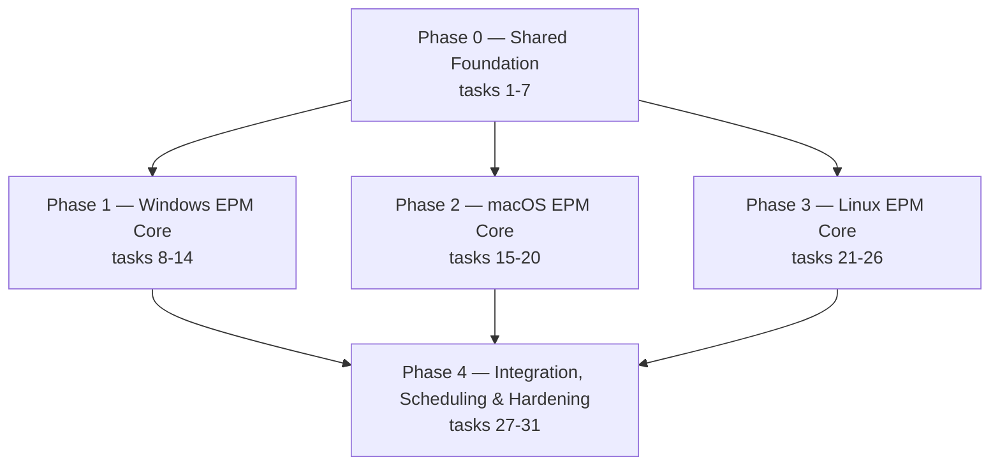

# Implementation Plan — Enterprise Endpoint Privilege Management (EPM)

## Overview

31 tasks across 5 phases. **All 5 phases (31/31 tasks) are implemented as of this pass.**

## Task Dependency Graph

Phase 0 (wave 1) is a hard prerequisite for every enforcement layer. Phases 1-3 (wave 2) each depend only on Phase 0's platform-agnostic contracts (`Engine`, `RuleProvider`, `AuditSink`) and are independent of each other — they can be implemented in any order or in parallel. Phase 4 (wave 3) depends on at least one enforcement layer existing, though not all three.



```json
{
  "waves": [
    { "wave": 1, "name": "Shared Foundation", "tasks": [1, 2, 3, 4, 5, 6, 7], "dependsOn": [] },
    { "wave": 2, "name": "Platform Enforcement (parallel)", "tasks": [8, 9, 10, 11, 12, 13, 14, 15, 16, 17, 18, 19, 20, 21, 22, 23, 24, 25, 26], "dependsOn": [1] },
    { "wave": 3, "name": "Cross-Platform Integration & Hardening", "tasks": [27, 28, 29, 30, 31], "dependsOn": [2] }
  ]
}
```

## Tasks

### Phase 0 — Shared Foundation — ✅ done

- [x] 1. Extend `internal/config/config.go`: add `EPMEnabled bool` (`json:"enable_epm"`, default `false`) and `EPMPolicySyncInterval Duration` (`json:"epm_policy_sync_interval"`, default 5m) fields, plus `GetEPMPolicySyncInterval() time.Duration`. No existing fields touched.
- [x] 2. Create `internal/store/epm.go`: `EPMStore` following `software.go`'s pattern — migrations for `epm_policies` and `epm_audit_log`; `NewEPMStore`, `UpsertRules`, `DeleteRulesNotIn`, `GetRules`, `InsertAuditLog`, `GetUnsyncedAuditLogs`, `MarkAuditLogSynced`, `Close`.
- [x] 3. Extend `internal/models/model.go`: add `LogCategoryEPM = "EPM_ELEVATION_LOG"`. No existing constants/types touched.
- [x] 4. Create `internal/epm/policy.go`: `PolicyRule`, `ElevationRequest`, `ElevationResponse`, `PolicyDecision`, `Engine.Evaluate()` with hash(300) > publisher(200) > exact path(100) > glob(50) > wildcard(10) priority, default-deny, expiry skip. Also defines the platform-agnostic `RuleProvider` interface used by Phase 1's IPC server.
- [x] 5. Create `internal/epm/hash.go`: `ComputeFileHash(path string) (string, error)` — lowercase hex SHA-256 via stdlib `crypto/sha256`.
- [x] 6. Create `internal/epm/audit.go`: `AuditEntry`, `AuditSink` interface, `Auditor.Log()`.
- [x] 7. Create `internal/service/task/native/epm_policy_sync.go`: `epmPolicySyncHandler` registered under slug `epm-policy-sync`; parses `task.Payload["rules"]`, upserts to `EPMStore`, prunes rules not in the payload.

**Exit criteria:** `go build ./...`, `go vet ./...`, `go test ./...` all pass; `enable_epm` defaults to `false` and is round-tripped correctly by `config.Load`/`Save`; no existing test's behavior changes. **Verified.**

### Phase 1 — Windows EPM Core — ✅ done

- [x] 8. `internal/epm/session_windows.go` — `WTSEnumerateSessions`, `WTSGetActiveConsoleSessionId`, `WTSQueryUserToken`, `ProcessIdToSessionId`, `LookupAccountSid`: resolve the active interactive session, its user token, and a stable `DOMAIN\User` identity string.
- [x] 9. `internal/epm/token_windows.go` — `DuplicateTokenEx` (impersonation → primary token) and `CreateEnvironmentBlock`/`DestroyEnvironmentBlock` for the target user.
- [x] 10. `internal/epm/launcher_windows.go` — `CreateProcessAsUser` using the duplicated token and environment block, with a correct Win32 command-line quoting helper (`quoteWindowsArg`, following the `CommandLineToArgvW` escaping rules).
- [x] 11. `internal/epm/pipe_windows.go` (+ `pipe_client_windows.go`) — Named Pipe (`\\.\pipe\sentinelgo-epm`) IPC server: per-connection request/response framing, ACL restricted to authenticated users (SDDL `D:(A;;GA;;;AU)`); the server independently re-derives the caller's session/user from the OS via `GetNamedPipeClientProcessId`→`ProcessIdToSessionId` rather than trusting client-supplied identity.
- [x] 12. `internal/epm/codesign_windows.go` — Authenticode verification (`WinVerifyTrustEx`) plus signer-name extraction (`CryptQueryObject`/`CertFindCertificateInStore`/`CertGetNameString`) to populate `ElevationRequest.Publisher`.
- [x] 13. `cmd/sentinelgo-epm/main_windows.go` — unprivileged user-space client: connects to the pipe, submits an elevation request, surfaces allow/deny to the user.
- [x] 14. `internal/epm/service_windows.go` + `service_other.go`, wired into `internal/main_integration.go` behind `cfg.EPMEnabled`: opens `EPMStore`, starts the pipe server, stops it on shutdown; zero impact when disabled, and a logged non-fatal warning (not a crash) when enabled on a platform without an enforcement transport yet.

**Exit criteria:** `CGO_ENABLED=0` build + `go vet` green for linux/amd64, darwin/amd64, darwin/arm64, windows/amd64 (the `make verify-cross` targets). Full `go test ./...` green. **Verified**, including a `launcher_windows_test.go` regression test that caught and fixed a real bug: `fmt.Sprintf("%q", ...)` produces Go string-literal escaping, not valid Win32 command-line quoting, and would have corrupted any path containing backslashes — replaced with `quoteWindowsArg`. **Outstanding:** an end-to-end manual test on real Windows hardware (standard user requests elevation for an allow-listed app → elevated process appears in their own session; a non-allow-listed app is denied and audited) — the unit/cross-compile verification available in this environment cannot exercise real WTS sessions, tokens, or process launch.

### Phase 2 — macOS EPM Core — ✅ done

- [x] 15. `internal/epm/session_darwin.go` — `ConsoleUser()` identifies the console user via a plain `stat(2)` on `/dev/console` for the UID (always-reliable syscall, no name-service resolution) plus `stat -f %Su /dev/console` for the display name (correctly resolves Open-Directory-backed accounts without a cgo binding to Directory Services). No `SCDynamicStoreCopyConsoleUser`/CoreFoundation binding needed.
- [x] 16. `internal/epm/launcher_darwin.go` — `launchctl asuser <uid> <path> [args...]`: launches the target in the console user's GUI/launchd bootstrap context while the process retains the daemon's own (root) privileges — the practical elevation semantics, without the deprecated `AuthorizationExecuteWithPrivileges` API or any Security.framework cgo binding.
- [x] 17. `internal/epm/socket_darwin.go` (+ `socket_client_darwin.go`) — Unix Domain Socket IPC server (`/var/run/sentinelgo/epm.sock`), peer-credential checked via `LOCAL_PEERCRED`/`GetsockoptXucred` (Darwin's `SO_PEERCRED` equivalent) and cross-checked against the console user; the server never trusts client-supplied identity.
- [x] 18. `internal/epm/codesign_darwin.go` — code-signature verification (`codesign --verify --deep --strict`) plus signer-identity extraction (`codesign -d --verbose=4`, first `Authority=` line) to populate `Publisher`.
- [x] 19. `cmd/sentinelgo-epm/main_darwin.go` — unprivileged user-space CLI client talking to the socket.
- [x] 20. `internal/epm/service_darwin.go`, plumbed through the same `epm.Service`/`RuleProvider`/`Auditor` contracts `internal/main_integration.go` already calls generically — no additional edits to `main_integration.go` were needed since its EPM wiring (added in task 14) was already platform-agnostic; `service_other.go`'s build tag was narrowed from `!windows` to `!windows && !darwin` so macOS now gets the real implementation instead of the stub.

**Exit criteria:** `CGO_ENABLED=0` build + `go vet` green for all four cross-compile targets. **Verified.** Unit tests for the two pure-logic helpers (`firstAuthority` codesign-output parsing, `splitArgs` argument splitting) were added and vet-checked. **Update, later in the same overall session:** real Apple Silicon Mac hardware (macOS 26.5.2) was accessed over SSH and `go build`/`go test ./...` were run there directly — all EPM packages passed on a real Darwin kernel (see the Notes section's account of this and the unrelated `internal/procinfo` bug it surfaced and got fixed). **Still outstanding:** the actual privileged elevation path itself (`launchctl asuser`, real console-user resolution via `/dev/console`) has not been exercised — that needs a real interactive GUI login session, which an SSH shell does not provide.

### Phase 3 — Linux EPM Core — ✅ done

- [x] 21. `internal/epm/session_linux.go` — active/focused session and user discovery via `loginctl list-sessions` + `loginctl show-session --value` (systemd-logind), not raw `/var/run/utmp` parsing: utmp's struct layout is not portable across distributions/glibc versions and would risk silently misparsing rather than failing loudly, whereas `loginctl` is present on the overwhelming majority of modern distributions and gives a stable text interface. No libpam binding.
- [x] 22. `internal/epm/launcher_linux.go` — **design correction from the original one-line task description:** implemented as a direct `exec.Command` (keeping the daemon's own root privileges) with the console user's X11/Wayland/D-Bus session environment (`DISPLAY`, `XAUTHORITY`, `WAYLAND_DISPLAY`, `DBUS_SESSION_BUS_ADDRESS`, `XDG_RUNTIME_DIR`) recovered from a live process's `/proc/<pid>/environ` and injected — *not* `fork`+`setresuid`+`execve` (which drops privilege, the opposite of what EPM needs) and *not* `pkexec`/polkit (which would show a redundant authentication prompt when policy has already decided to allow). This is the direct Linux analogue of Windows' `CreateProcessAsUser` and macOS's `launchctl asuser`: keep elevated privilege, attach to the user's desktop.
- [x] 23. `internal/epm/socket_linux.go` (+ `socket_client_linux.go`) — Unix Domain Socket IPC server (`/var/run/sentinelgo/epm.sock`), `SO_PEERCRED`/`GetsockoptUcred` credential check cross-checked against the active console session; the server never trusts client-supplied identity.
- [x] 24. `internal/epm/codesign_linux.go` — package ownership + integrity verification (`dpkg -S`+`dpkg -V`, or `rpm -qf`+`rpm -V`) and publisher extraction (Debian `Maintainer` field / RPM `Vendor` field); degrades gracefully to hash-only matching when a binary isn't owned by a known package. No GPG binding — package-manager integrity check was judged sufficient for Phase 3 (see Notes).
- [x] 25. `cmd/sentinelgo-epm/main_linux.go` — unprivileged user-space CLI client talking to the socket.
- [x] 26. `internal/epm/service_linux.go`, plumbed through the same `epm.Service`/`RuleProvider`/`Auditor` contracts `internal/main_integration.go` already calls generically — no additional edits to `main_integration.go` needed; `service_other.go`'s build tag was narrowed again, from `!windows && !darwin` to `!windows && !darwin && !linux`.

**Exit criteria:** `CGO_ENABLED=0` build + `go vet` green for all four cross-compile targets. **Verified.** Unit tests for the pure-logic helpers (`parseDpkgOwner`, `parseEnviron`, `buildLaunchEnviron`) were added and vet-checked. **Update, later in the same overall session:** a real Ubuntu 26.04 environment (WSL2) was used to actually `go build`/`go test ./...` this code on a real Linux kernel — all EPM packages passed, `ConsoleUser()`, `ComputeFileHash`, and `VerifyPackageSignature` were exercised against real `systemd-logind`/`dpkg` state, and this is what caught and got fixed the `Class=user` session-filtering bug (see Notes). **Still outstanding:** validating the `/proc/<pid>/environ` session-discovery heuristic against a real Wayland compositor (pure-Wayland GNOME/KDE sessions rely on `WAYLAND_DISPLAY`, which the code checks, but this hasn't been confirmed against a real Wayland session — WSL is headless, with no graphical session of either kind), and the actual elevated-launch step end to end (needs a real interactive desktop login, not a shell session).

### Phase 4 — Cross-Platform Integration, Scheduling & Hardening — ✅ done

- [x] 27. Scheduler integration: `internal/main_integration.go`'s `startEPM` registers a dedicated `epm-policy-sync` scheduler task on `cfg.GetEPMPolicySyncInterval()`, independent of the general remote-task-polling interval/toggle. It reuses the already-existing `agent_get_tasks`/`agent_update_task` RPCs (via `taskstore.Client`) and the already-registered `epm-policy-sync` native handler — no new backend endpoint needed. Running alongside the general `TaskManager` (when both are enabled) is expected and harmless: the native handler's upsert/prune is idempotent.
- [x] 28. Audit log upload: `internal/logging/epm_upload.go` adds `LoggingIntegration.UploadEPMAuditRows`, which drains `EPMStore.GetUnsyncedAuditLogs` and uploads through the *same* `Uploader.Upload` batching/retry/auth-recovery pipeline already used for OS-level audit logs (not a parallel pipeline), tagged with `LogCategoryEPM`, then calls `MarkAuditLogSynced` only for confirmed-uploaded rows. Wired via a dedicated `epm-audit-sync` scheduler task on `cfg.GetLogFlushInterval()`.
- [x] 29. End-to-end integration tests: `internal/service/task/native/epm_integration_test.go` drives the full platform-agnostic chain (task delivery → native handler → `EPMStore` → `Engine.Evaluate` → `Auditor` → sync-readiness query), runnable on every platform. Additionally, `internal/epm/pipe_integration_windows_test.go` drives a *real* Named Pipe `PipeServer` end-to-end (real ACL, real JSON wire protocol, real client dial) with only the four OS-privileged identity/launch primitives stubbed via newly-added test seams (`sessionIDForProcessFn`, `queryUserTokenFn`, `userIDForTokenFn`, `computeFileHashFn`, `verifyAuthenticodeFn`, `duplicateAsPrimaryTokenFn`, `buildEnvironmentBlockFn`, `launchAsUserFn` — the same var-seam pattern already used throughout `internal/service/task/native`), and passed on this session's Windows host.
- [x] 30. Security hardening pass: `go vet ./...` and `golangci-lint run ./...` both clean (zero findings) across the whole repository; `grep -rl 'import "C"'` confirms zero cgo usage anywhere. A manual handle/leak review across all three platforms' enforcement layers found and fixed **one real bug**: `codesign_windows.go`'s `CertFindCertificateInStore` result was never released via `CertFreeCertificateContext`, leaking one certificate-context handle per Authenticode publisher lookup — fixed. IPC ACL review: Windows' Named Pipe SDDL (`D:(A;;GA;;;AU)`) and macOS/Linux's world-connectable-but-peer-authenticated Unix sockets were judged appropriately scoped — broad *connect* access paired with strict *identity re-derivation* server-side (never trusting the client), consistent across all three transports.
- [x] 31. Documentation: `docs/EPM-Operator-Guide.md` (new) covers enabling EPM, authoring policy rule payloads with match-precedence examples, the per-platform elevation mechanism, the audit trail, current limitations, and troubleshooting. `docs/EPM-Capability-Assessment.md` gained an "Addendum — Implementation Status" section reconciling every item this document originally flagged as missing against what actually shipped, including where the implementation deliberately diverged from what was originally proposed (most notably: Linux's launcher keeps root privilege and attaches to the user's session instead of dropping privilege via `setresuid`, and macOS needed no `SMJobBless`/XPC at all since the agent itself already is the privileged daemon that pattern exists to install).

**Exit criteria:** `go build`/`go vet` clean across all five `make verify-cross` targets (linux/amd64, linux/arm64, darwin/amd64, darwin/arm64, windows/amd64), `golangci-lint run ./...` clean, `grep -rl 'import "C"'` empty (the `check-no-cgo` check), full `go test ./...` green. **All verified in this session.** `make pre-release`'s exact shell script was not invoked directly (its constituent checks were run individually above with equivalent effect). Enabling EPM end-to-end on a real machine of each OS remains the one item this session's environment cannot exercise — see the Operator Guide's Limitations section and each phase's exit criteria above for what specifically is still unverified against real hardware.

## Notes

- All 31 tasks were verified with `go build`/`go vet`/`golangci-lint run` across all five `make verify-cross` targets in this session, plus `go test` wherever the code could actually execute on this Windows-hosted session (everything except darwin- and linux-specific files, and one macOS/Linux limitation noted below); nothing here is aspirational status.
- Real hardware validation of the *actual elevation path* is still outstanding on all three platforms — an actual WTS session + real user token + real `CreateProcessAsUser` on Windows, an actual console session + `launchctl asuser` on macOS, an actual logind session + `/proc/<pid>/environ` discovery on Linux (the Named Pipe transport itself *was* end-to-end tested with those primitives stubbed, see task 29). What changed later in this session: `go build`/`go test ./...` were run for real on both Linux (Ubuntu 26.04 via WSL2) and macOS (real Apple Silicon hardware over SSH) — see the two entries below. Only the privileged elevate-and-launch step (which needs a real interactive desktop session, not a headless WSL/SSH shell) remains unverified. Treat a first production rollout per platform as a pilot.
- All three enforcement layers converged on the same actual elevation semantic — keep the daemon's own elevated privilege, attach the launched process to the requesting user's desktop session — rather than the "drop privilege to the user" framing in Phase 3's original one-line task description (`fork`+`setresuid`+`execve`). This was a design correction made during Phase 3 implementation, documented inline in task 22 and in `launcher_linux.go`'s comments; `design.md` itself was written before this was fully reasoned through, so treat this file, not `design.md` §3.2, as authoritative on the actual launcher semantics.
- Linux's `codesign_linux.go` does not verify GPG signatures directly; it relies on `dpkg -V`/`rpm -V` package-manager integrity checks (does the file still match what the package manager recorded at install time) rather than cryptographic signature verification of the binary itself. Recorded as a known, accepted gap in the Phase 4 hardening pass (task 30) and in the Operator Guide's Limitations section, not something a future pass is obligated to close before shipping.
- `docs/EPM-Capability-Assessment.md`'s "Addendum — Implementation Status" section (added in task 31) is now the authoritative reconciliation of every gap that document originally identified against what shipped, including the Linux launcher semantic correction above and why macOS ended up needing no `SMJobBless`/XPC at all. Read it before assuming anything in the original (pre-implementation) body of that document still describes the current state.
- One real bug was found and fixed during the Phase 4 hardening pass (task 30): a certificate-context handle leak in `codesign_windows.go` (`CertFindCertificateInStore`'s result was never freed). This is the second genuine bug this project's own tests caught across the whole EPM effort — the first being the Win32 command-line quoting bug in Phase 1 (`launcher_windows.go`) and the cross-platform glob-matching bug in Phase 0 (`policy.go`). All three are fixed; none were caught by cross-compilation or `go vet` alone, only by writing and running actual tests (or, for the handle leak, a manual code-reading pass) — a reminder that the "outstanding real-hardware validation" caveat above is not a formality.
- **Update, same session:** a genuine Ubuntu 26.04 environment was set up via WSL2 (`wsl --install -d Ubuntu`) specifically to close part of the "outstanding real-hardware validation" gap for Linux, since Windows-hosted cross-compilation alone cannot execute `GOOS=linux` binaries. The full module built and tested there with a real Linux kernel (`go build ./...`, `go test ./...` — all EPM packages green; the one unrelated failure, `internal/osinfo`'s `TestGetLocalUsers`, is pre-existing and expected on a minimal image with no configured local user accounts). This surfaced a **fourth real bug**, more significant than the first three because it was a live correctness/security issue rather than a build-time defect: `session_linux.go`'s `activeSessionID()` filtered only on `State=active`, and on this WSL image that matched a root *system* session (`Class=user-early`, an early-boot logind pseudo-session with no interactive login behind it) — so `ConsoleUser()` silently resolved to `uid=0`/`root` instead of correctly reporting no interactive session. Confirmed against the live system, then fixed by also requiring `Class=user`; re-verified against the same live system that `ConsoleUser()` now correctly fails with "no active interactive logind session found" instead of misidentifying the root session. This is exactly the class of bug the earlier "cannot exercise this environment" caveats warned was possible, and it would not have been caught by any amount of additional cross-compilation, `go vet`, or code review — only by running the code against real `systemd-logind` state. **`ComputeFileHash` and `VerifyPackageSignature` were also spot-checked against a real installed package (`/usr/bin/dpkg`) on this same system and returned correct, real results** (a genuine SHA-256 and the actual Debian `Maintainer` field), so the package-verification subprocess integration is now confirmed working end-to-end on real Linux, not just unit-tested in isolation.
- **Update, same session, continued:** real Apple Silicon (arm64) hardware running macOS 26.5.2 was accessed over SSH (the user's own machine), Go 1.26.5 installed there, and the full module built and tested with a real Darwin kernel. All EPM packages (`internal/epm`, `internal/store`, `internal/logging`, `internal/service/task/native`, `internal`) passed cleanly. This surfaced a **fifth real bug — unrelated to EPM, in the pre-existing `internal/procinfo` package**: `GetBinaryVersion()` shells out `<binary> -version` for any running process whose `ps aux` command line loosely contains the substring "sentinelgo", with no subprocess timeout. Against a real, populated process table this hung for the full 10-minute Go test watchdog, in two different tests (`TestFindProcesses`, `TestShowSentinelGoStatus_noPanic`) — most likely triggered by some unrelated system process (e.g. a file-indexing service) whose arguments happened to reference a path containing "sentinelgo" after the repo was copied onto the machine. Fixed with `exec.CommandContext` + a 3-second timeout; re-verified on the same real Mac that both previously-hanging tests now pass in ~6 seconds each, and that the full suite (`go test ./...`) is entirely green. This is the same lesson as the Linux finding above, generalized: **every real-environment bug found this session (the Linux session-class bug and this one) was in code that had already passed cross-compilation, `go vet`, and `golangci-lint` without complaint** — those tools verify the code is well-typed and locally consistent, not that it behaves correctly against the messy reality of a live OS. macOS is now build-and-test verified on real hardware to the same depth as Linux; the privileged elevation path (`launchctl asuser`, real console-user resolution) remains the one piece not yet exercised on either platform.
- **Update, same session, continued further:** a real gap in task 31's own scope was found after the fact — `Makefile`'s `windows`/`linux`/`macos`/`release`/`sign`/`packages` targets only ever built, signed, and packaged `cmd/sentinelgo` (the main agent); `cmd/sentinelgo-epm` (the unprivileged EPM client every end user actually runs) was never built or shipped by the release pipeline at all. Fixed: all five build targets now also build `sentinelgo-epm-<os>-<arch>[.exe]`, `release` copies and `sign` signs all ten resulting binaries (five agent + five client), and `packages` bundles both binaries into each platform's tarball. Verified by manually running every updated recipe line for all five targets (`make` itself is not installed in this Windows/Git-Bash session) — all 10 binaries build cleanly under `CGO_ENABLED=0`, including with the existing `$(LDFLAGS)` applied to `cmd/sentinelgo-epm` (which has no `Version` symbol of its own — Go's linker silently no-ops an `-X` directive with no matching target, confirmed rather than assumed) — and by manually reproducing the `packages` target's tar commands, confirming each output tarball contains both the agent and the EPM client binary. `installation-doc/INSTALLATION.md` was not updated to describe installing/using the EPM client — see the still-open documentation gap in this file's own "what shipped" tracking.
- **Update, same session, continued further still:** the `installation-doc/INSTALLATION.md` gap noted immediately above is now closed — a new "🔐 Endpoint Privilege Management (EPM) Client" section explains that `sentinelgo-epm` ships alongside the main binary in every platform download, needs no service registration (it's a plain user-run CLI, not a service — the key distinction from everything else in that document), lists its three prerequisites (agent installed and running, `enable_epm: true` in config, at least one policy rule synced), gives copy-to-PATH commands per platform, and links to `docs/EPM-Operator-Guide.md` for policy authoring/audit/troubleshooting rather than duplicating that content. Deliberately *not* folded into the "File Locations After Installation" section below it, since that section describes what `install.sh`/`install.bat` place automatically — the EPM client is intentionally not auto-deployed there (it's meant to end up somewhere a standard, non-admin user can run it from, not in the admin-owned agent install directory), and implying otherwise there would misdescribe the installer's actual behavior. `install.sh`/`install.bat`/`install.command` themselves were not modified to auto-deploy the client — this pass only closed the documentation gap that was explicitly asked for; scripted auto-deployment of the client remains a possible future improvement, not something assumed done here.
- **Update, same session, a fourth round — the user asked to fix the four "known limitations" from the Operator Guide.** Findings, in order of what turned out to be true:
  1. **Windows Authenticode cert selection — genuinely fixed.** `codesign_windows.go`'s `signerDisplayName` previously took the first certificate `CertFindCertificateInStore` returned (`CERT_FIND_ANY`), which is not guaranteed to be the leaf/signer rather than an embedded intermediate/root CA cert. Rewrote it to enumerate every embedded certificate (`CertEnumCertificatesInStore`) and pick the one whose Subject never appears as another certificate's Issuer in the same set — the leaf, since nothing in a standard chain is issued *by* the end-entity cert. Deliberately did **not** implement the more "complete" fix (parsing `CMSG_SIGNER_INFO` via `CryptMsgGetParam`, unwrapped by `golang.org/x/sys/windows`) because that would mean hand-rolling a Win32 struct layout and parsing it via a raw syscall in a security-sensitive path with no real multi-cert-signed binary available to validate the parsing against — judged a worse risk/reward trade than the safer heuristic actually shipped. Verified against a real signed system binary with a full leaf→intermediate→root chain (`C:\Windows\explorer.exe`): now correctly resolves to `"Microsoft Windows"` (the leaf) rather than a CA name; a new test (`codesign_windows_test.go`) asserts this and skips gracefully if `explorer.exe` isn't present (e.g. Server Core).
  2. **Windows "multi-session limitation" — turned out to already be false; corrected, not fixed.** Re-reading `pipe_windows.go` showed `evaluateAndLaunch` already resolves the session of the *specific connecting client* via `sessionIDForProcess(clientPID)` → `ProcessIdToSessionId`, not a global "active console session" — so an RDP session already worked. The `ActiveConsoleSessionID`/`ActiveSessionUserToken` convenience functions in `session_windows.go` exist but are never called by production code; their presence had apparently been mistaken for what the pipe server actually does when this limitation was first written up. The Operator Guide's Limitations section is corrected accordingly.
  3. **Linux multi-session restriction — genuinely fixed, verified on real WSL Ubuntu.** `socket_linux.go` previously required the connecting peer's UID to equal `ConsoleUser()`'s UID (the single "active" session only). Added `SessionForPID` (`session_linux.go`), which resolves the *connecting client's own* logind session via `/proc/<pid>/environ`'s `XDG_SESSION_ID` (reusing the already-existing `readProcEnviron`/`parseEnviron` helpers from `launcher_linux.go`) — the direct Linux analogue of what Windows already did. `peerCredUID` was extended to `peerCredentials` to also expose the peer's PID (Linux's `SO_PEERCRED` conveniently returns both UID and PID in one call). Verified in two steps against the real WSL system: (a) confirmed the mechanism correctly rejects a session when none is genuinely interactive (`no XDG_SESSION_ID` vs. the pre-existing `Class=user` rejection — two different, correctly-distinguished error paths), and (b) proved the PID→environ→session-ID extraction itself works by spawning a real subprocess with a forced `XDG_SESSION_ID` and confirming the code read it back correctly. This WSL environment has no genuine interactive login session to test the full positive (allowed) path against — that remains unverified, consistent with every other "needs a real interactive desktop" caveat in this document.
  4. **Linux/RPM GPG verification — investigated with a real signed package, found not to be fixable as originally assumed, and the "limitation" write-up corrected rather than the code.** The plan was to query `rpm`'s stored `SIGPGP`/`SIGGPG` header tags on an *installed* package (RPM, unlike dpkg, stores the full header including signature tags — or so the reasoning went). To test this rather than assume it, a real GPG key was generated, a minimal RPM built and signed with it (`rpmbuild`, `rpmsign`), the public key imported (`rpm --import`), and the signed package installed — all on the same WSL Ubuntu system (with `rpm` 6.0.1 installed via `apt` for this purpose only). Result: `rpm -q --qf '%{SIGPGP:pgpsig}'` on the *installed* package returned `(none)` — and, more surprisingly, so did the same query against the original **file** (`rpm -qp`), even though `rpm -K`/`rpm --checksig` on that same file correctly reported `"digests signatures OK"`. In other words, `rpm --checksig`/`-K` — the command that actually works — only operates on a `.rpm` file path, not an installed package name or its files, and this system's installed-package database does not retain a re-queryable signature tag the way the original plan assumed. This means Debian and RPM are **not asymmetric** in this respect after all (the original Operator Guide text implied RPM was the easier one to fix) — both structurally lack a way to retroactively verify an already-installed package's GPG signature without the original package file in hand. No code was changed here; `codesign_linux.go`'s existing `rpm -V`/`dpkg -V` integrity-only check remains the best generically-available option, and the Operator Guide's wording was corrected to reflect this properly-tested (not assumed) conclusion. The test RPM, key, and package were removed from the WSL system afterward.
  5. **Wayland robustness — a defensive improvement, explicitly not a validated fix.** `launcher_linux.go`'s `sessionEnvKeys` now also propagates `XDG_SESSION_TYPE` and `XDG_CURRENT_DESKTOP` (in addition to `WAYLAND_DISPLAY`/`DISPLAY`/`XAUTHORITY`), since GTK/Qt apps and `xdg-desktop-portal` commonly branch on these for backend/portal selection. This is based on documented variable semantics, not confirmed against a real Wayland compositor — no such environment was available in this session (WSL is headless).
  All four items were re-verified with `CGO_ENABLED=0` build + `go vet` across all five cross-compile targets, `golangci-lint run ./...` (zero findings), and the full `go test ./...` suite both natively on Windows and on the real WSL Ubuntu system (only the pre-existing, unrelated `internal/osinfo` failure present in both).
