<div align="center">


# SentinelGo

### One lightweight agent. Total endpoint visibility. Continuous compliance.

<p>
A single, dependency-free binary that turns every Windows, macOS, and Linux device<br/>
into a continuously-monitored, audit-ready endpoint — hardware inventory, security posture,<br/>
encryption status, and tamper-evident audit logs, streamed to your backend in real time.
</p>

<br/>

[](#-runs-everywhere-your-fleet-does)
[](#-build-from-source)
[](#-build-from-source)
[](#-license)

<br/>

[](https://sonarcloud.io/summary/new_code?id=BrainStation-23_SentinelGo)
[](https://sonarcloud.io/summary/new_code?id=BrainStation-23_SentinelGo)
[](https://sonarcloud.io/summary/new_code?id=BrainStation-23_SentinelGo)
[](https://sonarcloud.io/summary/new_code?id=BrainStation-23_SentinelGo)
[](https://sonarcloud.io/summary/new_code?id=BrainStation-23_SentinelGo)
[](https://sonarcloud.io/summary/new_code?id=BrainStation-23_SentinelGo)
[](https://sonarcloud.io/summary/new_code?id=BrainStation-23_SentinelGo)
[](https://sonarcloud.io/summary/new_code?id=BrainStation-23_SentinelGo)

<br/>

[**Quick Start**](#-quick-start) &nbsp;·&nbsp; [**What it captures**](#-what-it-captures) &nbsp;·&nbsp; [**How it works**](#-how-it-works) &nbsp;·&nbsp; [**Configuration**](#%EF%B8%8F-configuration) &nbsp;·&nbsp; [**Docs**](#-documentation)

</div>

<br/>

---

## ✨ Why teams choose SentinelGo

Most compliance and asset-management tools ship a heavy stack — a kernel module here, a Python runtime there, a different installer per OS, and an agent that drifts out of date the moment you deploy it. SentinelGo takes the opposite approach.

<br/>

<table>
<tr>
<td width="50%" valign="top">

**📦 Zero dependencies, anywhere**

Every build is a `CGO_ENABLED=0` static binary. No runtime, no shared libraries, no per-machine toolchain. Drop one file on a box and it runs — identically on a 2019 Windows Server, an Apple Silicon MacBook, and an ARM64 Linux node.

</td>
<td width="50%" valign="top">

**🔄 Deploy once, stay current forever**

Built-in self-update checks GitHub Releases, downloads the right binary for the platform, verifies it, and replaces itself atomically — so your fleet never falls behind without manual intervention.

</td>
</tr>
<tr>
<td width="50%" valign="top">

**⚙️ Runs as a first-class service**

Native Windows Service, systemd unit, and launchd daemon. Install with one command; the agent survives reboots and automatically restarts on failure.

</td>
<td width="50%" valign="top">

**🔒 Built for compliance from day one**

Durable, at-least-once audit-log delivery backed by a local SQLite queue means events survive network outages and reboots instead of being silently dropped.

</td>
</tr>
<tr>
<td width="50%" valign="top">

**🪶 Tiny footprint**

A single background process designed for minimal CPU and memory impact — built to monitor, not to get in the way.

</td>
<td width="50%" valign="top">

**🔐 Secure by design**

Per-agent JWT authentication, HTTPS-only transport, Supabase Row Level Security on every endpoint, and PII redaction before data leaves the machine.

</td>
</tr>
</table>

<br/>

---

## 📡 What it captures

> SentinelGo gives you a live, structured picture of every endpoint — far beyond "is it online."

<br/>

<details open>
<summary><b>🖥️ &nbsp;Complete hardware &amp; system inventory</b></summary>
<br/>

CPU (model, cores, clock, usage), memory, per-disk capacity and health, GPUs, RAM modules (per-slot), displays, audio devices, printers, and connected peripherals (with vendor/product IDs). Plus OS name and version, architecture, locale, timezone, uptime, and last boot — refreshed on every heartbeat.

</details>

<details open>
<summary><b>🔐 &nbsp;Security &amp; compliance posture</b></summary>
<br/>

| Category | What's collected |
|---|---|
| **Disk encryption** | BitLocker (Windows), FileVault (macOS), LUKS (Linux) — including hardware vs. software type |
| **Antivirus** | Installed products, enabled state, definition currency |
| **Firewall** | Status and per-profile configuration |
| **OS hardening** | Secure Boot, VBS/HVCI, Credential Guard (Windows) · SIP (macOS) · SELinux/AppArmor/kernel lockdown (Linux) |
| **Ports** | Listening ports mapped to the owning process |
| **Firmware** | BIOS/UEFI vendor and version, TPM presence and version |

</details>

<details open>
<summary><b>🌐 &nbsp;Network visibility</b></summary>
<br/>

Per-adapter details: MAC, type, link speed, connection status, IPv4/IPv6 addressing (with DHCP and subnet info), default gateway, DNS servers, and Wi-Fi SSID + signal strength.

</details>

<details open>
<summary><b>📦 &nbsp;Software &amp; extension inventory</b></summary>
<br/>

Installed applications and versions across every major source — Windows programs and Microsoft Store, Debian/RPM/Snap/Flatpak, Homebrew and casks, and the macOS App Store — with first-seen / last-seen change tracking. Includes browser-extension inventory for Chrome, Firefox, Edge, and Brave.

</details>

<details open>
<summary><b>📝 &nbsp;Tamper-evident audit log streaming</b></summary>
<br/>

Continuous, normalized audit events from each platform's native source:

- **Windows** — Event Log (Security, System, Defender, PowerShell, Task Scheduler, Firewall, RDP, Group Policy, and more)
- **Linux** — auth/syslog and journald
- **macOS** — unified log

Events are categorized, severity-tagged, checkpointed, and uploaded in batches with exponential-backoff retry — nothing is lost across restarts or outages.

</details>

<details open>
<summary><b>👥 &nbsp;Local account inventory</b></summary>
<br/>

Local user accounts with group membership — without collecting sensitive credential material.

</details>

<br/>

---

## 🌍 Runs everywhere your fleet does

| Platform | Architectures | Service model |
|---|---|---|
|  &nbsp;**Windows** | `amd64` | Windows Service |
|  &nbsp;**macOS** | `arm64` (Apple Silicon) &nbsp;·&nbsp; `amd64` (Intel) | launchd daemon |
|  &nbsp;**Linux** | `amd64` &nbsp;·&nbsp; `arm64` | systemd unit |

Every target is cross-compiled from a single host into a static binary — no per-platform build farm required.

<br/>

---

## 🛠️ Built with

<div align="center">

[](https://go.dev)
[](https://sqlite.org)
[](https://supabase.com)
[](https://github.com/features/actions)
[](https://sonarcloud.io)

</div>

<br/>

---

## ⚡ How it works

```mermaid
flowchart TD
    GH["🐙 GitHub Releases"]

    subgraph Backend["&nbsp;&nbsp;&nbsp;&nbsp;&nbsp;&nbsp;&nbsp;&nbsp;&nbsp;&nbsp;&nbsp;&nbsp;&nbsp;&nbsp;&nbsp;&nbsp;&nbsp;&nbsp;&nbsp;&nbsp; ☁️ Supabase Backend &nbsp;&nbsp;&nbsp;&nbsp;&nbsp;&nbsp;&nbsp;&nbsp;&nbsp;&nbsp;&nbsp;&nbsp;&nbsp;&nbsp;&nbsp;&nbsp;&nbsp;&nbsp;&nbsp;&nbsp;"]
        D["📈 Dashboards"]
        AL["🔔 Alerting"]
        T["📋 Task queue"]
        U["📦 Update store"]
    end

    subgraph Agent["&nbsp;&nbsp;&nbsp;&nbsp;&nbsp;&nbsp;&nbsp;&nbsp;&nbsp;&nbsp;&nbsp;&nbsp;&nbsp;&nbsp;&nbsp;&nbsp;&nbsp;&nbsp;&nbsp;&nbsp;&nbsp;&nbsp; 🛡️ SentinelGo Agent &nbsp;&nbsp;&nbsp;&nbsp;&nbsp;&nbsp;&nbsp;&nbsp;&nbsp;&nbsp;&nbsp;&nbsp;&nbsp;&nbsp;&nbsp;&nbsp;&nbsp;&nbsp;&nbsp;&nbsp;&nbsp;&nbsp;"]
        M["📊 Metrics"]
        S["📦 Software inventory"]
        A["📝 Audit logs"]
    end

    GH -->|"release assets synced"| U

    Agent -->|"authenticate — JWT"| Backend
    T -->|"tasks / commands"| Agent
    U -->|"binary download & replace"| Agent

    M -->|"heartbeat"| D
    S -->|"inventory sync"| D
    A -->|"log batches"| AL
```



<br/>

| Step | What happens |
|---|---|
| **1. Authenticate** | The agent logs in to a Supabase Edge Function and receives a short-lived JWT, auto-refreshed in the background with a circuit breaker. |
| **2. Report** | System metrics are collected and sent as a heartbeat on a configurable interval (default 5 min), plus periodic full hardware/software inventory. |
| **3. Stream** | Audit logs are collected from OS-native sources, normalized, durably queued in SQLite, and uploaded with at-least-once delivery. |
| **4. Stay current** | The backend syncs release assets from GitHub Releases. The agent polls for available updates, downloads the binary from the backend, replaces itself atomically, and restarts cleanly. |

<br/>

---

## 🚀 Quick start

**1. Download** the release for your platform from [GitHub Releases](https://github.com/BrainStation-23/SentinelGo/releases/latest).

**2. Place** the binary in the install directory:

| Platform | Path |
|---|---|
|  Linux &nbsp;/&nbsp;  macOS | `/opt/sentinelgo/` |
|  Windows | `C:\sentinelgo\` |

**3. Create** a `config.json` (see [Configuration](#%EF%B8%8F-configuration) below).

**4. Install and start** the service:

```bash
# Linux / macOS (as root)
sudo ./sentinelgo -install

# Windows (as Administrator)
.\sentinelgo.exe -install

# Run in foreground for debugging (any OS)
./sentinelgo -run
```

📖 Full per-OS walkthrough: [`installation-doc/INSTALLATION.md`](installation-doc/INSTALLATION.md)

<br/>

---

## ⚙️ Configuration

The agent reads a single JSON file. Default locations:

| OS | Path |
|---|---|
|  Linux &nbsp;/&nbsp;  macOS | `/opt/sentinelgo/.sentinelgo/config.json` |
|  Windows | `C:\sentinelgo\.sentinelgo\config.json` |

Override with `-config <path>`. Common fields:

```json
{
  "supabase_url":           "https://<your-project>.supabase.co",
  "supabase_key":           "<anon-key>",
  "agent_secret":           "<agent-login-secret>",
  "auto_update":            true,
  "auto_update_interval":   "24h",
  "update_interval":        "5m",
  "audit_logs_enabled":     true,
  "software_sync_enabled":  true,
  "log_flush_interval":     "5m"
}
```

Every field can also be set via environment variable. The agent never embeds credentials in the binary — it authenticates at runtime and rotates its JWT automatically.

📖 Full reference: [`docs/02-config-module.md`](docs/02-config-module.md)

<br/>

---

## 💻 Command-line interface

```bash
# Service management
sentinelgo -install             # install as a system service (admin/root)
sentinelgo -uninstall           # remove the service
sentinelgo -run                 # run in the foreground
sentinelgo -status              # show installed/running processes and versions
sentinelgo -version             # print version
sentinelgo -config PATH         # use a custom config file

# Operations
sentinelgo -collect-logs        # force an immediate audit-log collection
sentinelgo -upload-logs         # flush pending audit logs
sentinelgo -software-list       # show installed software inventory
sentinelgo -agent-info-update   # refresh hardware/system inventory
```

📖 Full flag reference: [`docs/agent-commands-guide.md`](docs/agent-commands-guide.md)

<br/>

---

## 🔨 Build from source

```bash
make build                 # dev build  →  bin/sentinelgo[.exe]
make test                  # go test ./...
make verify-cross          # type-check every GOOS/GOARCH with CGO_ENABLED=0
make check-no-cgo          # fail if any import "C" is introduced
make pre-release           # full quality gate + build
make release VERSION=vX.Y.Z
```

> All builds are `CGO_ENABLED=0` static binaries cross-compiled from a single host. **Go 1.26+ required.**

<br/>

---

## 📚 Documentation

| Document | What it covers |
|---|---|
| [`docs/08-project-overview.md`](docs/08-project-overview.md) | Architecture, package layout, runtime flow |
| [`docs/01-main-module.md`](docs/01-main-module.md) | CLI, flag parsing, service entry point |
| [`docs/02-config-module.md`](docs/02-config-module.md) | Configuration schema and validation |
| [`docs/05-osinfo-module.md`](docs/05-osinfo-module.md) | Cross-platform hardware metrics |
| [`docs/06-service-module.md`](docs/06-service-module.md) | Service lifecycle and auth |
| [`docs/07-updater-module.md`](docs/07-updater-module.md) | Self-update flow |
| [`docs/audit-logs-architecture.md`](docs/audit-logs-architecture.md) | Audit-log pipeline end-to-end |
| [`installation-doc/INSTALLATION.md`](installation-doc/INSTALLATION.md) | Per-OS install steps |
| [`SECURITY.md`](SECURITY.md) | Vulnerability reporting and security architecture |

<br/>

---

## 🔐 Security & privacy

- All backend communication is over **HTTPS** with a per-agent JWT — obtained at runtime, never hardcoded.
- Local-account collection captures **usernames and group membership only** — never credential material.
- Script payloads are downloaded from a **RLS-gated** Supabase Storage bucket using the agent's own JWT.
- The `internal/sanitize` package **redacts PII and credential-like patterns** from task outputs before upload.
- Release binaries include a `SHA256SUMS` file. Verify before running: `sha256sum -c SHA256SUMS`.

📖 Full security policy and architecture: [`SECURITY.md`](SECURITY.md)

<br/>

---

## 🤝 Contributors

All contributions are welcome — bug reports, feature requests, documentation improvements, and code.

<a href="https://github.com/BrainStation-23/SentinelGo/graphs/contributors">
  
</a>

*Made with [contrib.rocks](https://contrib.rocks)*

<br/>

---

## 💎 Sponsors

<div align="center">

**SentinelGo is proudly sponsored by**

<br/>

<a href="https://brainstation-23.com">
  
</a>

<br/><br/>

**[BrainStation-23](https://brainstation-23.com)** &nbsp;·&nbsp; Software engineering & technology services, building impactful digital products worldwide.

</div>

<br/>

---

## 📄 License

Distributed under the **Apache 2.0** License. See [`LICENSE`](LICENSE) for details.

<br/>

<div align="center">

Made with ❤️ by the SentinelGo team &nbsp;·&nbsp; [Report a bug](https://github.com/BrainStation-23/SentinelGo/issues) &nbsp;·&nbsp; [Security policy](SECURITY.md)

</div>
