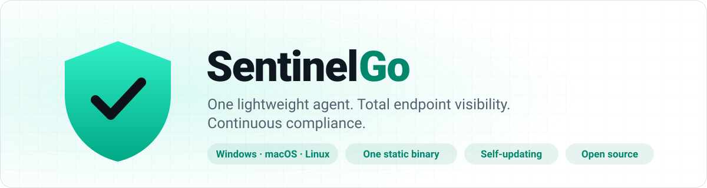
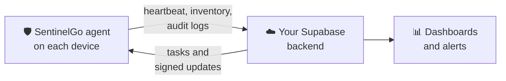

<div align="center">

<a href="https://brainstation-23.github.io/SentinelGo/">
  <picture>
    <source media="(prefers-color-scheme: dark)" srcset="docs/assets/banner-dark.svg">
    
  </picture>
</a>

<br/>

[](https://github.com/BrainStation-23/SentinelGo/releases/latest)
[](LICENSE)
[](https://scorecard.dev/viewer/?uri=github.com/BrainStation-23/SentinelGo)
[](https://sonarcloud.io/summary/new_code?id=BrainStation-23_SentinelGo)

**[Website](https://brainstation-23.github.io/SentinelGo/)** &nbsp;·&nbsp;
**[Download](https://github.com/BrainStation-23/SentinelGo/releases/latest)** &nbsp;·&nbsp;
**[Install guide](installation-doc/INSTALLATION.md)** &nbsp;·&nbsp;
**[Docs](#-learn-more)** &nbsp;·&nbsp;
**[Changelog](CHANGELOG.md)**

</div>

<br/>

**SentinelGo turns every Windows, macOS and Linux machine in your fleet into a continuously monitored, audit-ready endpoint.** Drop one small file on a device and it starts reporting what's installed, how it's secured, and what's happening on it, then keeps itself up to date.

No runtime to install, no agent zoo, no per-OS tooling. Just one binary that runs as a native service and stays out of the way.

<br/>

## ✨ Why SentinelGo

<table>
<tr>
<td width="33%" valign="top">

### 📦 Deploy in minutes
One static binary per platform with no dependencies. Copy it, run `-install`, done. It runs as a Windows Service, systemd unit or launchd daemon and restarts itself on failure.

</td>
<td width="33%" valign="top">

### 🔍 See everything
Hardware, software, network, security posture and live audit logs from every device, in one consistent format across all three operating systems.

</td>
<td width="33%" valign="top">

### 🔄 Stays current by itself
Signed, verified self-updates roll out new versions across your fleet. No manual upgrades, no drift.

</td>
</tr>
<tr>
<td width="33%" valign="top">

### 🧾 Built for audits
Audit events are queued on disk and delivered at least once, so nothing is lost to a reboot or a network outage.

</td>
<td width="33%" valign="top">

### 🪶 Light footprint
A single background process built to monitor quietly, without slowing down the people using the machine.

</td>
<td width="33%" valign="top">

### 🔐 Secure by design
Per-agent authentication, HTTPS only, signed releases, and personal data redacted before it leaves the device.

</td>
</tr>
</table>

<br/>

## 📡 What you get from every device

| | |
|---|---|
| 🖥️ **Hardware & system** | CPU, memory, disks, GPUs, RAM modules, displays, printers and peripherals; OS, uptime and last boot |
| 🛡️ **Security posture** | Disk encryption (BitLocker, FileVault, LUKS), antivirus, firewall, Secure Boot, SIP, SELinux/AppArmor, TPM, open ports |
| 🌐 **Network** | Adapters, IP addressing, gateways, DNS and Wi-Fi details |
| 📦 **Software** | Installed apps from every major package source, with change history, plus browser extensions |
| 📝 **Audit logs** | Windows Event Log, Linux journald and auth logs, macOS unified log, normalized and severity-tagged |
| 👥 **Local accounts** | Users and group membership, never passwords or other credentials |

<br/>

## ⚡ How it works


```mermaid
flowchart LR
    A["🛡️ SentinelGo agent<br/>on each device"] -->|"heartbeat, inventory,<br/>audit logs"| B["☁️ Your Supabase<br/>backend"]
    B -->|"tasks and<br/>signed updates"| A
    B --> C["📊 Dashboards<br/>and alerts"]
```

1. **Authenticate:** each agent signs in and gets a short-lived token that it renews on its own.
2. **Report:** a heartbeat every few minutes, plus full hardware and software inventory.
3. **Stream:** audit events are collected, queued locally and uploaded in batches.
4. **Stay current:** new releases are downloaded, verified and installed automatically.

<br/>

## 🚀 Get started

**1. Download** the binary for your platform from the [latest release](https://github.com/BrainStation-23/SentinelGo/releases/latest).

| Windows | macOS | Linux |
|:---:|:---:|:---:|
| `amd64` | Apple Silicon · Intel | `amd64` · `arm64` |

**2. Add your backend details** to a [`config.json`](#configuration) next to the binary.

**3. Install it as a service:**

```bash
sudo ./sentinelgo -install       # Linux / macOS
.\sentinelgo.exe -install        # Windows, as Administrator
```

That's it. The agent starts reporting right away and keeps running across reboots.

📖 Step-by-step instructions for each OS, including checksum verification, are in the **[install guide](installation-doc/INSTALLATION.md)**.

<br/>

<details>
<summary><b id="configuration">⚙️ Configuration</b></summary>
<br/>

The agent reads one JSON file:

| OS | Path |
|---|---|
| Linux / macOS | `/opt/sentinelgo/.sentinelgo/config.json` |
| Windows | `C:\sentinelgo\.sentinelgo\config.json` |

```json
{
  "supabase_url":           "https://<your-project>.supabase.co",
  "supabase_key":           "<anon-key>",
  "agent_secret":           "<agent-login-secret>",
  "auto_update":            true,
  "auto_update_interval":   "24h",
  "update_interval":        "5m",
  "audit_logs_enabled":     true,
  "software_sync_enabled":  true,
  "log_flush_interval":     "5m"
}
```

Use `-config <path>` for a different location. Every field can also be set with an environment variable. No credentials are built into the binary.

Full reference: [`docs/02-config-module.md`](docs/02-config-module.md)

</details>

<details>
<summary><b>💻 Command-line reference</b></summary>
<br/>

```bash
sentinelgo -install             # install as a system service (admin/root)
sentinelgo -uninstall           # remove the service
sentinelgo -run                 # run in the foreground
sentinelgo -status              # show installed/running processes and versions
sentinelgo -version             # print version
sentinelgo -config PATH         # use a custom config file

sentinelgo -collect-logs        # collect audit logs now
sentinelgo -upload-logs         # flush pending audit logs
sentinelgo -software-list       # show installed software inventory
sentinelgo -agent-info-update   # refresh hardware/system inventory
```

Full reference: [`docs/agent-commands-guide.md`](docs/agent-commands-guide.md)

</details>

<details>
<summary><b>🔨 Build from source</b></summary>
<br/>

Requires Go 1.26 or newer. Every build is a `CGO_ENABLED=0` static binary, and all platforms cross-compile from a single machine.

```bash
make build                 # dev build -> bin/sentinelgo[.exe]
make test                  # run the test suite
make verify-cross          # type-check every GOOS/GOARCH
make release VERSION=vX.Y.Z
```

</details>

<br/>

## 🔐 Security

- **HTTPS only**, with a per-agent token issued at runtime. Nothing secret is embedded in the binary.
- **Signed releases.** Every binary is signed and checksummed, and both the updater and the installers verify it before running anything.
- **Privacy first.** Account inventory never includes credentials, and personal data is redacted from task output before upload.
- **Continuously checked.** CodeQL, gosec, govulncheck, Trivy and SonarCloud run on every change, and parsers are fuzzed nightly.

Found a vulnerability? Please report it privately. See **[SECURITY.md](SECURITY.md)**.

<br/>

## 📚 Learn more

| | |
|---|---|
| 🚀 **Using SentinelGo** | [Install guide](installation-doc/INSTALLATION.md) · [Configuration](docs/02-config-module.md) · [CLI](docs/agent-commands-guide.md) · [Changelog](CHANGELOG.md) |
| 🏗️ **How it's built** | [Project overview](docs/08-project-overview.md) · [Updater](docs/07-updater-module.md) · [Audit-log pipeline](docs/audit-logs-architecture.md) · [Hardware metrics](docs/05-osinfo-module.md) |
| 🤝 **The project** | [Contributing](CONTRIBUTING.md) · [Governance](GOVERNANCE.md) · [Releases](RELEASE.md) · [Security policy](SECURITY.md) · [Code of Conduct](CODE_OF_CONDUCT.md) |

<br/>

## 🙌 Get involved

Bug reports, ideas, docs and code are all welcome.

[](https://github.com/BrainStation-23/SentinelGo/issues/new?template=bug_report.yml)
[](https://github.com/BrainStation-23/SentinelGo/issues/new?template=feature_request.yml)
[](https://github.com/BrainStation-23/SentinelGo/discussions)

New here? Start with the **[contributing guide](CONTRIBUTING.md)**.

<a href="https://github.com/BrainStation-23/SentinelGo/graphs/contributors">
  
</a>

<br/>

<details>
<summary><b>📈 Project health</b></summary>
<br/>

[](https://sonarcloud.io/summary/new_code?id=BrainStation-23_SentinelGo)
[](https://sonarcloud.io/summary/new_code?id=BrainStation-23_SentinelGo)
[](https://sonarcloud.io/summary/new_code?id=BrainStation-23_SentinelGo)
[](https://sonarcloud.io/summary/new_code?id=BrainStation-23_SentinelGo)
[](https://sonarcloud.io/summary/new_code?id=BrainStation-23_SentinelGo)
[](https://sonarcloud.io/summary/new_code?id=BrainStation-23_SentinelGo)
[](https://sonarcloud.io/summary/new_code?id=BrainStation-23_SentinelGo)
[](https://app.fossa.com/projects/git%2Bgithub.com%2FBrainStation-23%2FSentinelGo?ref=badge_shield)

</details>

<br/>

---

<div align="center">

**Sponsored by**

<a href="https://brainstation-23.com">
  
</a>

<br/><br/>

Licensed under [Apache 2.0](LICENSE) &nbsp;·&nbsp; Made with ❤️ by the SentinelGo team

</div>
